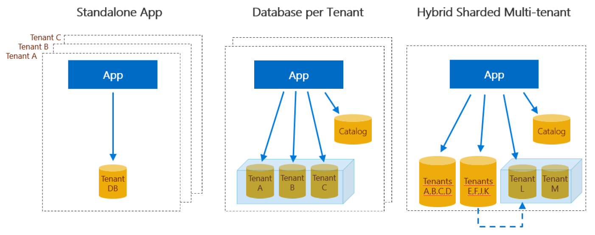

# WingtipSaaS
A series of sample SaaS applications, each representing a common design pattern for SaaS applications built on SQL Database.

Each of the sample apps includes a series of management scripts and tutorials to help you jump start your own SaaS app project. These are designed to demonstrate a range of SaaS-focused designs and management patterns that can accelerate SaaS application development on SQL Database.

The sample application is a simple event listing and ticketing SaaS app, where each venue is a tenant with events, ticket prices, customers, and ticket sales. The management scripts and tutorials demonstrate building out an end-to-end SaaS scenario. SQL Database and other Azure services are showcased as they help you build the application, monitor and manage the tenants, and create cross-tenant analytics, all at scale.

1. This multi-tenant sample app uses a [database-per-tenant model](https://github.com/Microsoft/WingtipTicketsSaaS-DbPerTenant), with a database created for each venue.  These databases are hosted in elastic database pools to provide easy performance management, and to cost-effectively accommodate the unpredictable usage patterns of these small venues and their customers.  An additional catalog database holds the mapping between tenants and their databases.  This mapping is managed using the Shard Map Management features of the Elastic Database Client Library.

2. This multi-tenant sample app uses the [multi-tenant database model](https://github.com/Microsoft/WingtipTicketsSaaS-MultiTenantDb). This allows you to optimize for lowest cost with multiple tenants in the same database, or optimize for isolation with a single tenant in a database. The choice can be made on a tenant-by-tenant basis, either when the tenant is provisioned or later, with no impact on the design of the application.

3. This sample app, unlike the others, provides a [single-tenant application](https://github.com/Microsoft/WingtipTicketsSaaS-StandaloneApp) and a single-tenant database.

More information about the sample apps and the associated tutorials is here: [https://aka.ms/sqldbsaastutorial](https://aka.ms/sqldbsaastutorial)

Also available in the Documentation folder in this repo is an **overview presentation** that provides background, explores each SaaS app design model, and walks through several of the SaaS patterns at a high level. There is also a demo script you can use with the presentation to give others a guided tour of the app and several of the patterns.

## License
Microsoft Wingtip SaaS sample application and tutorials are licensed under the MIT license. See the [LICENSE](https://github.com/Microsoft/WingtipSaaS/blob/master/license) file for more details.

# Contributing
This project has adopted the [Microsoft Open Source Code of Conduct](https://opensource.microsoft.com/codeofconduct/). For more information see the [Code of Conduct FAQ](https://opensource.microsoft.com/codeofconduct/faq/) or contact [opencode@microsoft.com](mailto:opencode@microsoft.com) with any additional questions or comments.
